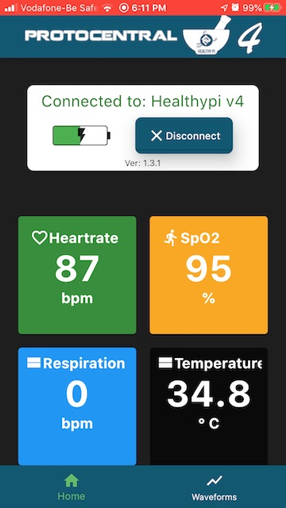
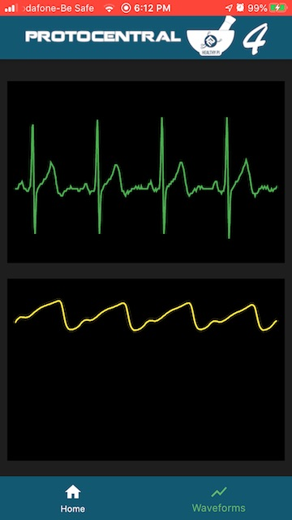

# ProtoCentral HealthyPi v4 Connect App

This repository contains the Flutter-based codebase for the HealthyPi v4 mobile app for Android and iOS. If you're looking for the main HealthyPi 4 repo or to purchase one, please visit https://healthypi.protocentral.com/

  

HealthyPi v4 is a HAT for the Raspberry Pi, as well as a standalone device that can measure human vital signs that are useful in medical diagnosis and treatment. HealthyPi 4 is affordable and accessible and the open source aspect means that it’s easy to expand upon.

# License Information

This product is open source! All hardware, software and documentation are open source and licensed under the terms of the following licenses:

## Hardware

All hardware is released under [Creative Commons Share-alike 4.0 International](http://creativecommons.org/licenses/by-sa/4.0/).

## Software

All software is released under the MIT License(http://opensource.org/licenses/MIT).

## Documentation

All product documentation is released under Creative Commons Share-alike 4.0 International.

For detailed license information, please check LICENSE.MD.

Please check [*LICENSE.md*](LICENSE.md) for detailed license descriptions.
